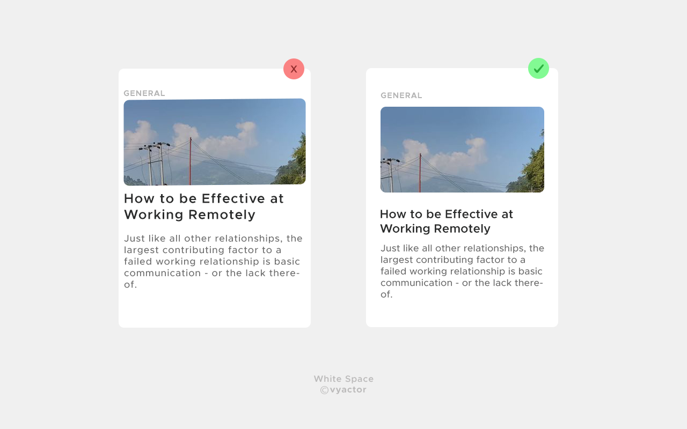
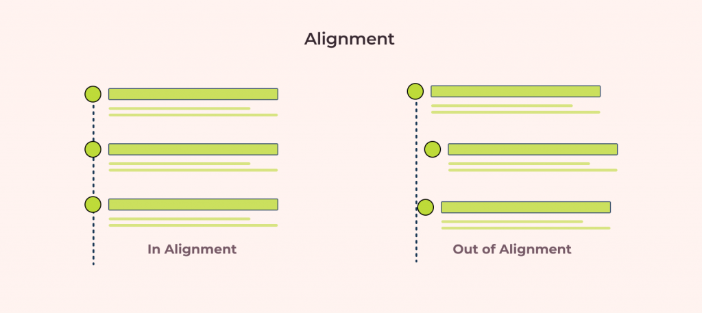
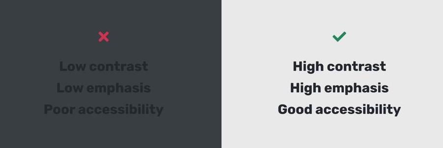
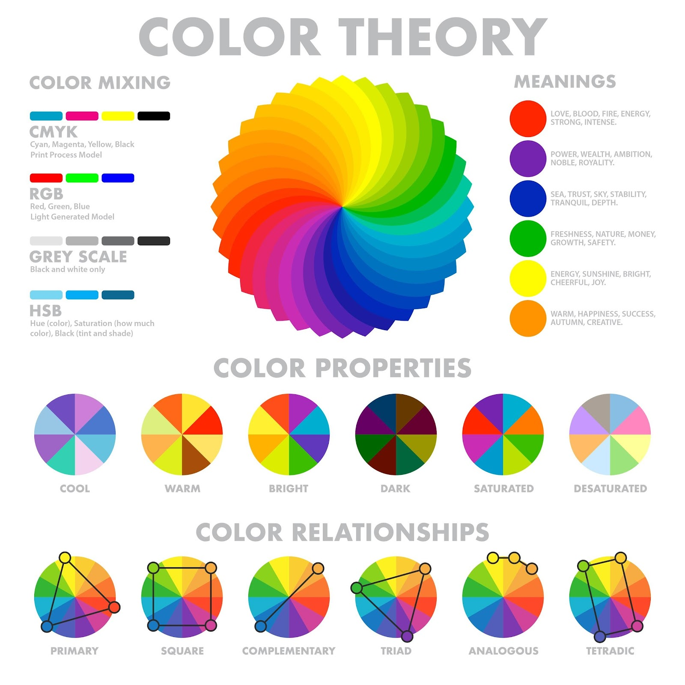

# Design - UI Fundamentals

Here is a link to my [Figma file]()

## Explanation of UI Fundamentals

### Whitespace

White space is the empty space between layouts, lines in paragraphs words, between multiple design elements, etc. These elements could be images, typography, illustrations, icons and so on. White space doesn’t refer to an empty white background and it doesn’t necessarily have to be white as well, it can be of any colour or pattern and therefore we also call it as negative space.

> Designers love it, website owners want to fill it. Whitespace seems to be one of the most controversial aspects of design.  
>  — Paul Boag

  
### Alignment
Alignment helps us to create a sense of unity by providing structure and connecting elements in a subtle, yet powerful way. In design, the alignment principle states that multiple objects are said to be aligned when they are placed such that their left or right edges, or center-lines line up on a common position.  
Most modern design tools, like Figma, allow for layout grids that acts as guide.
  

### Contrast

Contrast is the amount of inequality between two design elements, where more inequality means that the two design elements can be more easily differentiated. Increasing contrast aids accessibility, i.e. it improves the user's ability to see these elements even if they have a visual impairment.  
Obvious examples of contrast are black and white, big and small, thick and thin.

### Color

Color can set the basic mood, tone, concept, and connotation for a website or app. Colors provoke emotions in customers. Avoid overload and chaos in design, minimalism is always better in UI. Use the 60/30/10 rule, neutral color for 60%, secondary brand color for 30% and brand/accent color for 10%.

  
### Scale
Enlarged elements are easier to notice. Consider an article, which consists of numerous sections divided by headings. An increased font size of the headings makes them more noticeable, which is ideal because headings are known to improve the scannability of content, i.e. how fast users can digest content using summaries.
  

  
### Proximity
The principle of proximity states that items close together are likely to be perceived as part of the same group — sharing similar functionality or traits. Using varying amounts of whitespace to either unite or separate elements is key to communicating meaningful groupings.
  

  
### Typography
Typography involves font style, appearance, and structure, aiming to elicit certain emotions and convey specific messages to the end-user. Typography helps design to deliver information to people. Font size, font width, font color, and line lengths — all elements of typography work together to create a great user experience.
  
  

### Visual Hierarchy

The order in which we notice various design elements and the level of importance that they each convey.

