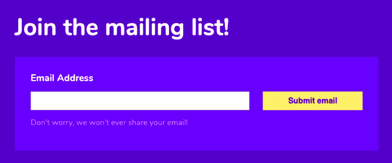

# Design - UI Fundamentals

In this project I designed a front page for a restaurant using the UI fundamentals explained below.  
Here is a link to my [Figma file](https://www.figma.com/file/Ruy4LMz1aSi5mjdWFWQqKM/UI-Fundamentals?node-id=0%3A1). 
There are comments on the design file about what elements of UI fundamentals I am using.
 

 
 

## Explanation of UI Fundamentals

### Whitespace

White space is the empty space between layouts, lines in paragraphs words, between multiple design elements, etc. These elements could be images, typography, illustrations, icons and so on. White space doesn’t refer to an empty white background and it doesn’t necessarily have to be white as well, it can be of any colour or pattern and therefore we also call it as negative space.

> Designers love it, website owners want to fill it. Whitespace seems to be one of the most controversial aspects of design.  
>  — Paul Boag

 
  
### Alignment
Alignment helps us to create a sense of unity by providing structure and connecting elements in a subtle, yet powerful way. In design, the alignment principle states that multiple objects are said to be aligned when they are placed such that their left or right edges, or center-lines line up on a common position.  
Most modern design tools, like Figma, allow for layout grids that acts as guide.
  

 
  
### Contrast

Contrast is the amount of inequality between two design elements, where more inequality means that the two design elements can be more easily differentiated. Increasing contrast aids accessibility, i.e. it improves the user's ability to see these elements even if they have a visual impairment.  
Obvious examples of contrast are black and white, big and small, thick and thin.

 
  
### Color

Color can set the basic mood, tone, concept, and connotation for a website or app. Colors provoke emotions in customers. Avoid overload and chaos in design, minimalism is always better in UI. Use the 60/30/10 rule, neutral color for 60%, secondary brand color for 30% and brand/accent color for 10%.

 
  
### Scale
Scale describes the relative sizes of the elements in a design. Enlarged elements are easier to notice. Elements should be big enough in relation to the page (so no large gaps) and elements with higher importance, such as headlines, should be larger than those of less significance.
  

 
  
### Proximity
The principle of proximity states that items close together are likely to be perceived as part of the same group — sharing similar functionality or traits. Using varying amounts of whitespace to either unite or separate elements is key to communicating meaningful groupings.
  

 
  
### Typography
Typography has a big impact on the UI. There are many ways to adjust this, including font choices, font size, alignment, letter spacing, line height, font styles, color and contrast. As a general rule, use no more than 2 font families on a single page and ensure the different aspects work together in order to establish the order of importance.
  

 
  
### Visual Hierarchy

The order in which we notice various design elements and the level of importance that they each convey. Some elements of a UI are more important than others. Visual hierarchy allows us to establish this importance. This can be done with position, contrast, color, scale, style or a combination of the above

